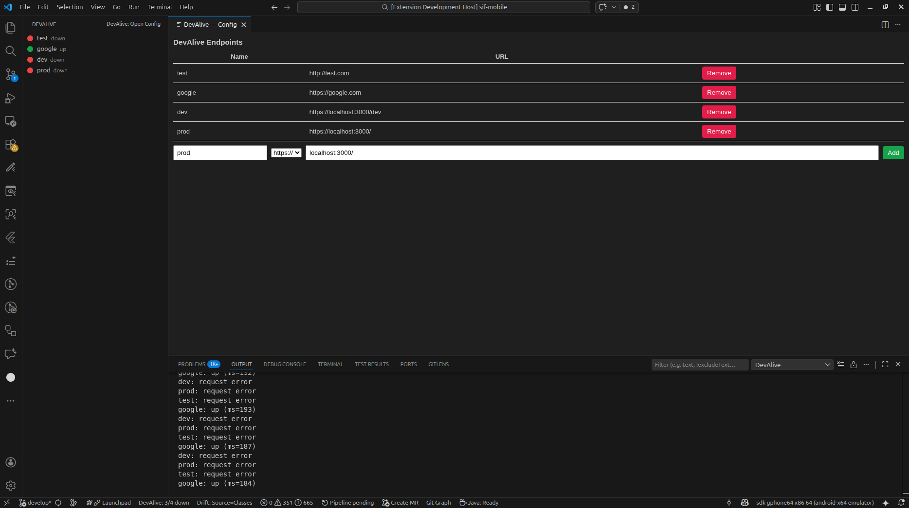

# DevAlive

DevAlive displays and monitors API endpoints directly in the VS Code Explorer. It performs periodic HTTP(S) checks and shows concise status indicators:

- Green — up
- Yellow — slow (response time above configured threshold)
- Red — down

Replace the placeholder images in `images/` with real screenshots before publishing to the Marketplace.

# DevAlive

DevAlive monitors API endpoints from the VS Code Explorer and shows a clear health status for each endpoint:

- Green — up
- Yellow — slow (response time above configured threshold)
- Red — down



## Features

- Explorer tree with named endpoints and status icons
- Periodic HTTP/HTTPS checks with timeout and slow thresholds
- Workspace-scoped configuration via `.vscode/devalive.json`
- Small config panel to add/remove endpoints (`DevAlive: Open Config`)
- Open endpoints in the default browser from the tree view

## Usage

1. Open a folder/workspace in VS Code.
2. Open the DevAlive view in the Explorer or Activity Bar.
3. Use the view title button or run `DevAlive: Open Config` to add or remove endpoints.
4. Optionally edit `.vscode/devalive.json` in the workspace root.

Example `.vscode/devalive.json`:

```json
[{ "name": "local", "url": "http://localhost:3000/health" }]
```

If the file is not present the extension will read `devalive.endpoints` from workspace settings (legacy fallback).

## Settings

- `devalive.pingInterval` — interval between checks in ms (default: `5000`).
- `devalive.timeout` — request timeout in ms (default: `2000`).
- `devalive.slowThreshold` — ms above which a response is considered slow (default: `1000`).

## Commands

- `DevAlive: Open Config` — open the add/remove panel (creates `.vscode/devalive.json` if needed)
- `DevAlive: Add Endpoint` — add an endpoint via quick input
- `DevAlive: Remove Endpoint` — remove an endpoint via quick pick
- `DevAlive: Refresh` — refresh the tree view immediately

## Troubleshooting

- Make sure a folder/workspace is open so `.vscode/devalive.json` can be saved in the workspace root.

## Contributing

Contributions are welcome — open issues or pull requests on the repository.

## License

This project is licensed under the MIT License — see `LICENSE`.

---

## Português (pt-BR)

DevAlive monitora endpoints de API pelo Explorer do VS Code e exibe um estado claro para cada endpoint:

- Verde — up
- Amarelo — slow (tempo de resposta acima do limiar configurado)
- Vermelho — down


## Recursos

- View no Explorer com endpoints nomeados e ícones de status
- Checagens HTTP/HTTPS periódicas com timeout e limiar para lento
- Configuração por workspace via `.vscode/devalive.json`
- Painel compacto para adicionar/remover endpoints (`DevAlive: Open Config`)
- Abrir endpoints no navegador direto da árvore

## Uso

1. Abra uma pasta/workspace no VS Code.
2. Abra a view DevAlive no Explorer ou Activity Bar.
3. Use o botão do título da view ou execute `DevAlive: Open Config` para adicionar/remover endpoints.
4. Opcionalmente edite `.vscode/devalive.json` na raiz do workspace.

Exemplo `.vscode/devalive.json`:

```json
[{ "name": "local", "url": "http://localhost:3000/health" }]
```

Se o arquivo não existir, a extensão lerá `devalive.endpoints` nas configurações do workspace (fallback legado).

## Configurações

- `devalive.pingInterval` — intervalo entre checagens em ms (padrão: `5000`).
- `devalive.timeout` — timeout da requisição em ms (padrão: `2000`).
- `devalive.slowThreshold` — ms acima do qual a resposta é considerada lenta (padrão: `1000`).

## Problemas comuns

- Verifique se uma pasta/workspace está aberta para que `.vscode/devalive.json` possa ser salvo na raiz do workspace.

## Contribuição

Contribuições são bem-vindas — abra issues ou pull requests no repositório.

## Licença

Projeto licenciado sob MIT — veja `LICENSE`.

### Uso

1. Abra uma pasta/workspace no VS Code.
2. Abra a view DevAlive no Explorer ou Activity Bar.
3. Use o botão do título da view ou execute `DevAlive: Open Config` para gerenciar endpoints.
4. Opcionalmente, edite `.vscode/devalive.json` na raiz do workspace.

### Configuração de Exemplo

```json
[{ "name": "local", "url": "http://localhost:3000/health" }]
```

### Configurações

- `devalive.pingInterval` — intervalo entre checagens em ms. Padrão: `5000`.
- `devalive.timeout` — timeout da requisição em ms. Padrão: `2000`.
- `devalive.slowThreshold` — ms acima do qual é considerado lento. Padrão: `1000`.

### Publicação

- Verifique `publisher`, `version`, `repository`, imagens e `LICENSE` antes de publicar.

---
